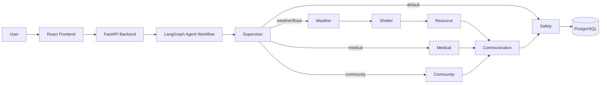

# Salaam Compass

"Guiding communities safely through crisis, together."

## Overview
Salaam Compass is an AI-powered emergency coordination platform designed to help communities during crises with compassionate, structured guidance. The project combines a React frontend, a FastAPI backend, and a LangGraph-based multi-agent workflow that routes emergency requests through specialized agents.

## Project Goals
- Help people describe an emergency in natural language.
- Route the request to the most relevant support agent.
- Provide safety-focused, confidence-based responses.
- Store emergency information and audit decisions for later review.
- Demonstrate a modular AI agent architecture for real-world emergency response scenarios.

## Tech Stack
- Frontend: React, TypeScript, Vite
- Backend: FastAPI, SQLAlchemy, Pydantic
- Agent Orchestration: LangGraph
- Database: PostgreSQL with pgvector support
- Containerization: Docker, Docker Compose
- Deployment: Kubernetes manifests are included

## System Architecture



## How the Agents Connect
The workflow is built around a supervisor-driven graph:

1. The user sends a message from the chat UI.
2. The backend receives the request at `/agent/run`.
3. The LangGraph workflow starts from the `Supervisor` node.
4. The supervisor inspects the message and decides which sub-agent should handle it.
5. The selected agent produces a response and passes control forward.
6. The final `Safety` node masks sensitive data, calculates a confidence score, and returns a final status.

### Agent Flow Summary
- `Supervisor`: Detects the intent and chooses the next agent.
- `Weather`: Handles weather or flood-related guidance.
- `Medical`: Handles medical or hospital-related needs.
- `Community`: Handles volunteer, community, or rescue coordination scenarios.
- `Shelter`: Provides shelter information.
- `Resource`: Provides nearby resource details such as water, food, and blood banks.
- `Communication`: Coordinates outreach and messaging.
- `Safety`: Applies safety checks and final response validation.

## How Tools Are Handled
The project includes a tool layer in `backend/agents/tools.py` for future MCP-style integrations.

### Current Tool Definitions
- `google_maps_route(origin, destination)`: mock route-planning helper
- `openweather_forecast(location)`: mock weather lookup helper
- `get_shelters(location)`: mock shelter lookup helper

### Important Note
These tools are defined as LangChain tools and are prepared for integration with the agent workflow. In the current version, the runtime flow uses deterministic agent responses rather than live tool calls, but the structure is ready for expansion into real external services.

## Project Running Process
Here is the runtime path of the application:

1. The user opens the frontend and types an emergency message.
2. The React chat component sends the message to the backend API.
3. FastAPI creates the initial agent state and calls the LangGraph workflow.
4. The workflow runs each node in sequence and collects responses and confidence values.
5. The backend returns the full agent path, message responses, confidence score, and status.
6. The frontend displays the agent responses and final safety status to the user.

### Request Flow Example
- Frontend: `frontend/src/components/Chat.tsx`
- API call: `frontend/src/api.ts`
- Backend endpoint: `backend/main.py`
- Agent graph: `backend/agents/graph.py`
- State definition: `backend/agents/state.py`
- Tool definitions: `backend/agents/tools.py`

## Data Layer
The backend uses SQLAlchemy models to persist:
- `users`: basic user identity
- `emergencies`: emergency reports and severity fields
- `messages`: conversation history
- `audit_logs`: agent decisions and confidence values
- `knowledge`: emergency knowledge records

## Running the Project
### With Docker Compose
```bash
docker compose up --build
```

Then open:
- Frontend: http://localhost:5173
- Backend API docs: http://localhost:8000/docs
- Health check: http://localhost:8000/health

## Folder Structure
```text
backend/
  agents/
    graph.py
    state.py
    tools.py
  main.py
  database.py
  models.py
  schemas.py
frontend/
  src/
    components/
      Chat.tsx
      Dashboard.tsx
```

## Summary
Salaam Compass demonstrates how a modern AI agent system can be structured for emergency support scenarios using language models, multi-agent orchestration, safety checks, and a simple full-stack web experience.
